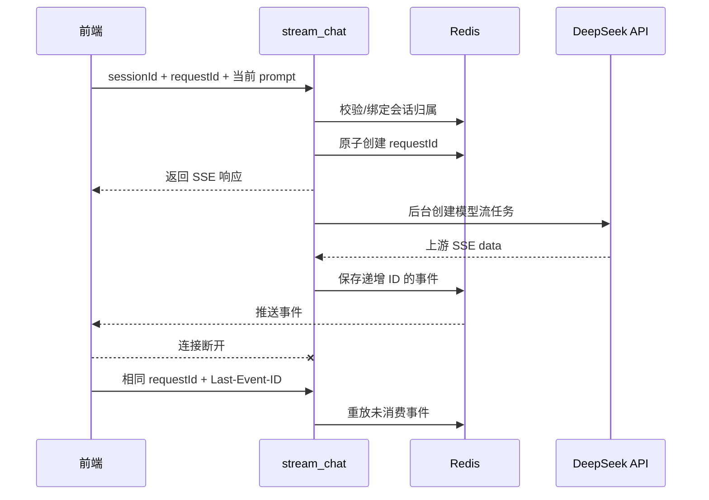

# Toutiao Backend

这是一个基于 FastAPI 的异步后端，包含用户认证、新闻分类/列表/详情、Redis 缓存以及 DeepSeek AI 聊天服务。

## 技术栈

| 类别 | 技术/库 | 用途 |
| --- | --- | --- |
| Web | FastAPI、Starlette、Uvicorn | HTTP API、依赖注入、异步服务和 SSE 响应 |
| 数据校验 | Pydantic、pydantic-core、annotated-types、typing-extensions、typing-inspection | 请求参数和响应模型 |
| 数据库 | SQLAlchemy、aiomysql、PyMySQL、greenlet | 异步 MySQL 连接、ORM 和事务 |
| 缓存 | redis、async-timeout | Redis 异步访问、新闻缓存、聊天历史和 SSE 事件缓存 |
| AI HTTP 客户端 | httpx、requests | DeepSeek 上游流式/非流式 HTTP 请求 |
| 认证安全 | bcrypt、passlib、cryptography、cffi、pycparser | 密码处理、令牌和密码学依赖 |
| 配置 | python-dotenv、PyYAML | 环境变量和配置文件支持 |
| 异步运行 | anyio、uvloop、httptools、watchfiles、websockets | 异步运行时和开发热更新支持 |
| 基础依赖 | certifi、charset-normalizer、click、h11、httpcore、idna、urllib3、exceptiongroup、annotated-doc | HTTP、CLI、证书和异步运行依赖 |

具体版本以 [requirements.txt](./requirements.txt) 为准。

## 项目结构

```text
toutiao_backend/
├── main.py                         # FastAPI 应用入口、CORS、路由注册
├── requirements.txt                # Python 依赖
├── config/
│   ├── db_conf.py                  # MySQL 异步引擎、ORM 基类、生命周期
│   └── cache_conf.py               # Redis 客户端和通用缓存读写
├── routers/
│   ├── user.py                     # 注册、登录、用户信息
│   ├── news.py                     # 新闻分类、列表、详情
│   └── deepseek.py                 # AI 聊天、会话历史、SSE
├── crud/
│   ├── user.py                     # 用户数据库操作和 token
│   ├── news.py                     # 新闻查询
│   ├── deepseek.py                 # 旧版非流式/流式聊天逻辑和限流
│   └── deepseek_stream.py          # 当前断点续传聊天后台任务和上下文裁剪
├── cache/
│   ├── deepseek_stream.py          # 聊天会话、请求、事件 Redis 操作
│   └── news_cache.py               # 新闻分类缓存
├── schemas/
│   ├── user.py                     # 用户请求/响应模型
│   └── deepseek.py                 # AI 请求/响应模型
├── models/
│   ├── user.py                     # 用户、token 数据模型
│   └── news.py                     # 新闻数据模型
└── utils/
    ├── auth.py                     # Bearer token 认证
    ├── security.py                 # 密码校验
    ├── response.py                 # 统一响应模型
    └── exception_handler.py        # 全局异常响应
```

## 应用启动流程

```text
启动 FastAPI
  -> 注册全局异常处理器
  -> 配置 CORS
  -> 创建 MySQL 异步引擎
  -> lifespan 中创建表结构
  -> 注册 user/news/deepseek 路由
  -> 接收请求
```

## AI 聊天功能

### 接口

| 方法 | 地址 | 功能 |
| --- | --- | --- |
| `POST` | `/api/chat/deepseek/start_chat` | 旧版非流式聊天，返回完整文本 |
| `GET` | `/api/chat/deepseek/conversations` | 获取当前用户最近会话摘要 |
| `GET` | `/api/chat/deepseek/conversations/{session_id}` | 获取指定会话历史 |
| `POST` | `/api/chat/deepseek/stream_chat` | 创建或恢复流式聊天 |

### 流式聊天业务流程



### 三个关键 ID

| ID | 作用 |
| --- | --- |
| `sessionId` | 独立多轮会话 ID，用于读取和写回聊天历史 |
| `requestId` | 单次模型生成 ID，用于防止重连重复创建上游任务 |
| `Last-Event-ID` | SSE 事件游标，用于断点续传 |

### 后端上下文组装

前端每轮只发送当前用户 prompt，后端从 Redis 读取：

```text
deepseek:chat_history:{session_id}
```

然后按以下步骤处理：

1. 读取历史消息。
2. 追加本轮 user 消息。
3. 裁剪到最近 20 条消息。
4. 避免从 assistant 消息中间开始上下文。
5. 将完整上下文发送给 DeepSeek。
6. 模型生成完成后追加 assistant 消息。

### Redis 聊天键

| Redis 键 | 功能 |
| --- | --- |
| `deepseek:chat_history:{session_id}` | 会话历史消息 |
| `deepseek:conversation:{session_id}:owner` | 会话所属用户 |
| `deepseek:conversation:{session_id}:meta` | 标题和更新时间 |
| `deepseek:conversations:user:{user_id}` | 用户最近会话有序索引 |
| `deepseek:stream:{request_id}:meta` | 流式请求状态和权限信息 |
| `deepseek:stream:{request_id}:events` | 已保存的 SSE 事件 |
| `deepseek:stream:{request_id}:next_id` | SSE 事件自增 ID |

聊天历史、会话元数据和 SSE 事件默认缓存 3600 秒。

## 认证与权限

- 认证方式为 `Authorization: Bearer <token>`。
- `get_current_user` 根据 token 查询当前用户。
- AI 流式请求首次访问会话时绑定用户归属。
- 后续访问必须匹配同一用户。
- 查询其他用户会话历史时返回 404。
- 同一个 `requestId` 还会校验用户和 `sessionId`，防止跨用户恢复流请求。

## 非 AI 接口概述

### 用户接口

| 方法 | 地址 | 功能 |
| --- | --- | --- |
| `POST` | `/api/user/register` | 注册用户并创建 token |
| `GET` | `/api/user/login` | 校验账号密码并返回 token |
| `GET` | `/api/user/info` | 获取当前用户信息 |
| `POST` | `/api/user/update` | 修改当前用户信息 |

### 新闻接口

| 方法 | 地址 | 功能 |
| --- | --- | --- |
| `GET` | `/api/news/categories` | 分页获取新闻分类，支持 Redis 缓存 |
| `GET` | `/api/news/list` | 按分类分页获取新闻列表 |
| `GET` | `/api/news/detail` | 获取新闻详情 |

## 数据库与缓存

- 数据库使用 SQLAlchemy Async ORM。
- 当前模型包含用户、用户 token、新闻和新闻分类。
- 应用启动生命周期会执行 `Base.metadata.create_all`。
- Redis 用于新闻分类缓存、会话历史、会话索引、流式事件和请求状态。
- 当前数据库连接和 Redis 地址位于配置代码中，生产环境应迁移到环境变量或独立配置文件。

## 统一响应与异常

普通 JSON 接口通常使用：

```json
{
  "code": 200,
  "message": "success",
  "data": {}
}
```

全局异常处理器统一处理：

- `HTTPException`
- 请求参数校验错误
- 数据库完整性错误
- SQLAlchemy 错误
- 未处理异常

SSE 接口保持 `text/event-stream`，不使用普通 JSON 包装，以保证浏览器可以持续读取事件。

## 开发与测试

```bash
python3 -m venv .venv
source .venv/bin/activate
pip install -r requirements.txt

uvicorn main:app --reload

python3 -m unittest discover -s tests -p 'test_*.py'
python3 -m compileall -q cache crud routers schemas
```

当前 mock 测试覆盖 Redis 请求幂等、会话归属、SSE 事件重放、上游 SSE 拆包和上下文裁剪。
